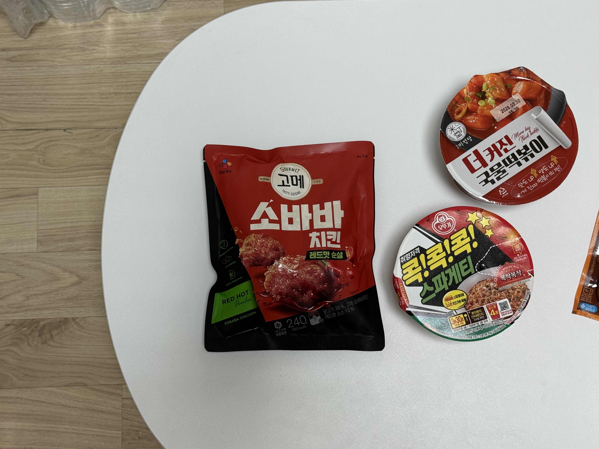
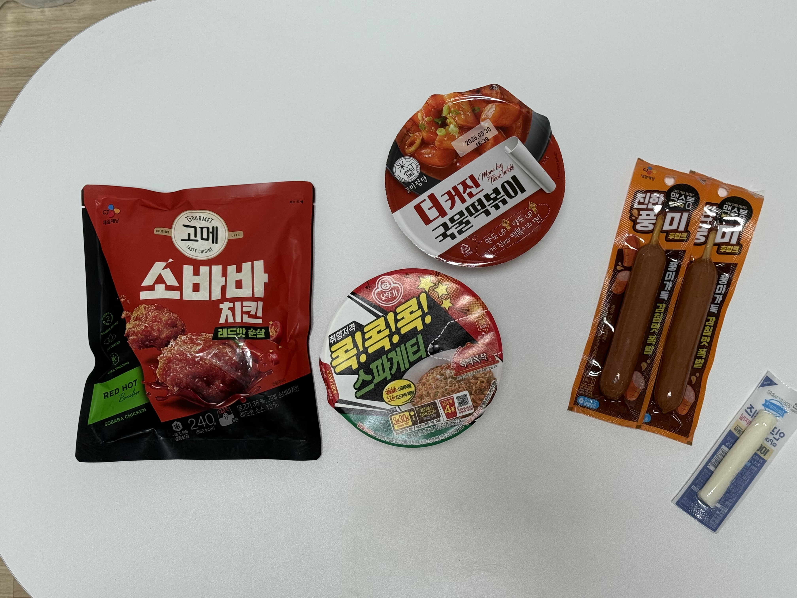
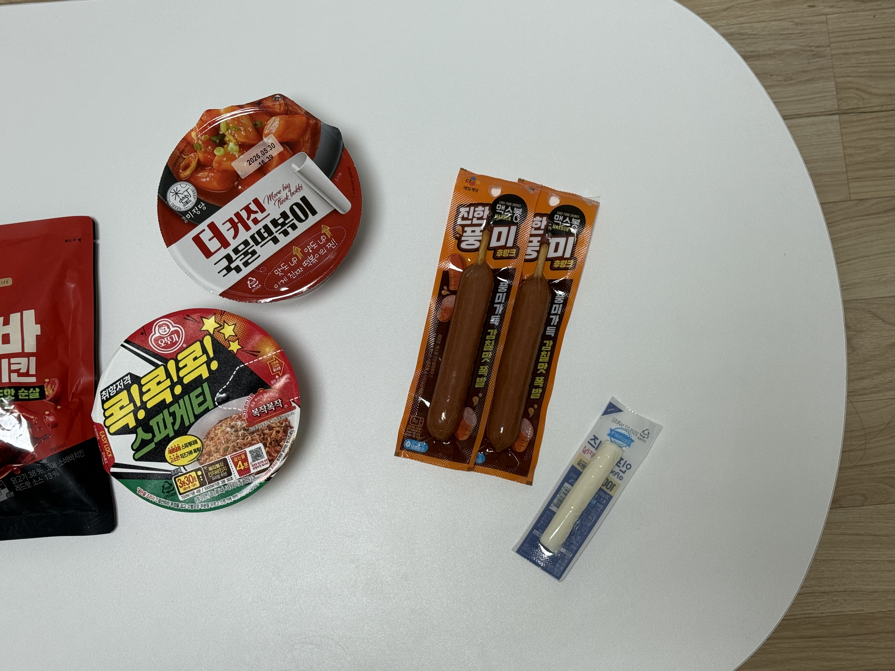
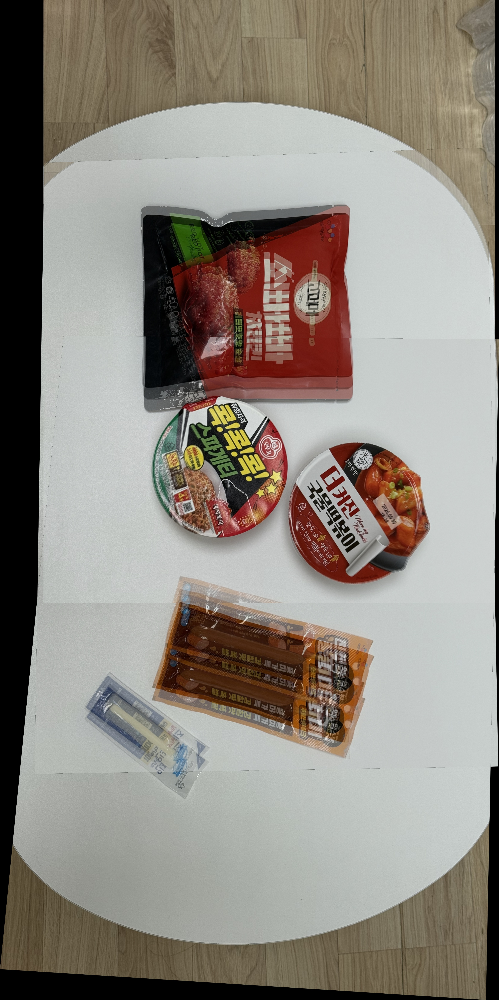

# Smooth Panorama Stitcher

OpenCV를 이용해 여러 장의 이미지를 자동으로 정합하여 하나의 큰 파노라마 이미지를 만드는 프로그램입니다.

## 주요 기능

- ORB 특징점 검출
- BFMatcher를 이용한 특징점 매칭
- Lowe's ratio test를 이용한 좋은 매칭점 선별
- RANSAC 기반 Homography 계산
- Perspective warping을 이용한 이미지 정합
- Alpha blending을 이용한 겹침 영역 자연스러운 합성

## 구현 방법

본 프로젝트는 OpenCV의 고수준 Stitcher API를 사용하지 않고, 이미지 스티칭 과정을 직접 구현했습니다.

전체 과정은 다음과 같습니다.

1. `images` 폴더에서 입력 이미지 불러오기
2. ORB를 이용해 각 이미지의 특징점과 descriptor 추출
3. BFMatcher로 이미지 간 특징점 매칭
4. Lowe's ratio test로 좋은 매칭점만 선택
5. RANSAC을 이용해 Homography 행렬 계산
6. Homography를 이용해 이미지를 같은 좌표계로 warping
7. 겹치는 영역을 alpha blending으로 합성
8. 최종 파노라마 이미지를 `results` 폴더에 저장

## 추가 기능: Alpha Blending

겹치는 영역을 단순히 덮어쓰지 않고 두 이미지의 픽셀 값을 평균 내어 합성했습니다.
이를 통해 이미지가 이어지는 부분의 경계가 덜 어색하게 보이도록 했습니다.

## 실행 환경

- Python 3
- OpenCV
- NumPy

## 설치 방법

```bash
pip install -r requirements.txt
```

## 실행 방법

`images` 폴더에 3장 이상의 겹치는 이미지를 넣습니다.

```text
images/
├─ img1.jpg
├─ img2.jpg
└─ img3.jpg
```

프로그램 실행:

```bash
python main.py
```

실행 후 결과 이미지는 다음 위치에 저장됩니다.

```text
results/panorama.jpg
```

## 입력 이미지







## 결과 이미지



## 프로젝트 구조

```text
smooth-panorama-stitcher/
├─ images/
│  ├─ img1.jpg
│  ├─ img2.jpg
│  └─ img3.jpg
├─ results/
│  └─ panorama.jpg
├─ main.py
└─ README.md
```

## 참고 사항

- 입력 이미지들은 서로 30~50% 정도 겹치도록 촬영했습니다.
- 책상 위의 물체들을 위에서 촬영하여 비교적 평면적인 장면을 사용했습니다.
